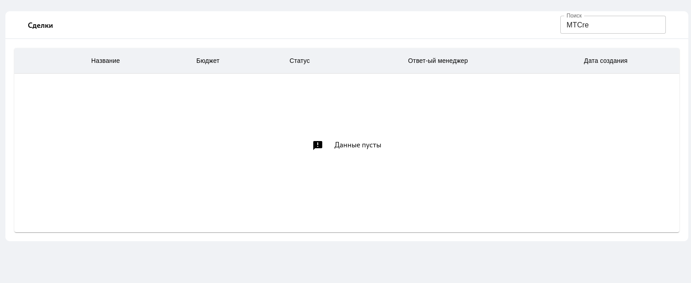

# nest_amo

## Get deal from amoCRM with NestJS

### Description 

API-приложение для доступа к сделкам и их контактам amoCRM (read-only), а также небольшое представление, которое будет использовать данный API

## Run

### NestJS and SPA

`cd service`

Create __.env__ file and add:

```PORT = 8080
CLIENT_SECRET=your secret
CLIENT_ID=your integration id
TOKEN_AMO=your token
AUTH_CODE= your code 
HREF=https://******.amocrm.ru/
REDIRECT_URI=your redirect

```

`npm i && npm run start`

Go to: <http://localhost:8080>

Go to swagger: <http://localhost:8080/docs>

### Front-end for development (React & Vite)

`cd client && npm i && npm run dev`

Go to <http://localhost:5173>

## View



